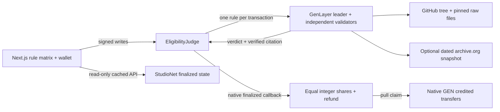

# Eligibility Judge

Open hackathon judging: every entry gets a rule-by-rule verdict anyone can verify.

Organizers publish 3–6 objectively checkable rules and fund a StudioNet GEN pool. Builders submit a public GitHub repository pinned to a full commit SHA. GenLayer validators independently fetch bounded evidence, judge one rule per transaction, and confirm the leader's file path and verbatim quote. Every entry that passes every rule qualifies. Contract code splits the pool equally; the organizer receives the remainder. There is no scoring, ranking, bidding, or organizer-selected winner.

## Architecture



## Local setup

Requires Node.js 20.9+ and Python 3.12+. The Windows development environment uses Python 3.14. Never put a private key in the app or browser bundle.

```sh
npm ci
python -m pip install -r requirements.txt
npm run dev
```

Open http://localhost:3111. The preserved proof snapshot opens without a wallet. Live chain reads come from `/api/chain`, which always requests `LATEST_FINAL`. A browser wallet signs writes on StudioNet 61999. The browser persists transaction hashes and resumes 5-second polling after reload; accepted results stay provisional until finality and callback completion.

## Contract deployment instructions

The runner is pinned to `py-genlayer:1jb45aa8ynh2a9c9xn3b7qqh8sm5q93hwfp7jqmwsfhh8jpz09h6`. Release dependencies pin `genlayer-py==0.18.0` and `genlayer-js==1.1.8`.

```sh
genlayer network set studionet
genlayer account list
genvm-lint check contracts/eligibility_judge.py
python -m pytest tests/direct -q
```

On Windows, use the staged, resumable deployment script with your already unlocked GenLayer CLI account:

```powershell
powershell -ExecutionPolicy Bypass -File scripts/deploy.ps1 probe
powershell -ExecutionPolicy Bypass -File scripts/deploy.ps1 deploy
powershell -ExecutionPolicy Bypass -File scripts/deploy.ps1 seed
powershell -ExecutionPolicy Bypass -File scripts/deploy.ps1 entries
powershell -ExecutionPolicy Bypass -File scripts/deploy.ps1 judge
powershell -ExecutionPolicy Bypass -File scripts/deploy.ps1 settle
npm run verify:proof
```

Each stage records hashes before waiting. Resume the same stage after a timeout; it reuses saved transactions. The `probe` stage requires the saved access-probe address. The demo entrants' test-wallet keys are generated into a gitignored `.env.demo-wallets.json` solely for StudioNet. `seed` funds 3 GEN, starts a one-hour window, and validates four rules. Publish this repository before entering its pinned source commit. Deployment scripts save receipts locally; `deploy/proof.json` is the public, compact manifest. Vercel deploys with a remote build: `vercel --prod --scope wattxs-projects`.

## Verification

```sh
npm run typecheck
npm run build
npm test
genvm-lint check contracts/eligibility_judge.py
python -m pytest tests/direct -q
npm run verify:proof
```

Direct tests mock web and LLM responses and do not claim validator consensus. The read-only proof verifier checks finalized execution, emitted callbacks, observed contract state, exact payout credit, and deployed source. Browser verification is recorded separately in `docs/browser-verification.json`.

## Proof and submission

- [Public proof manifest](deploy/proof.json): addresses, pinned source commit, access probes, transaction hashes, outcomes, transfers, and completion flags.
- [Contract on StudioNet](https://explorer-studio.genlayer.com/address/0x066f50FCb15Def2279A79Db23A6bC7a0130662d1).
- [Tutorial](docs/TUTORIAL.md), [two-minute demo](docs/DEMO.md), and [portal fields](docs/submission/portal-fields.json).
- [Official finality documentation](https://docs.genlayer.com/understand-genlayer-protocol/core-concepts/optimistic-democracy/finality).

Deployment and live demo verification are in progress. This statement is updated only once the retained manifest demonstrates every required live outcome and a credited payout. Nothing is submitted to the Portal automatically.

## Limitations

StudioNet is a development simulator. GEN here is not a production prize. Inspection is bounded to one 96,000-byte tree, ten files, and 12,000 bytes per file, plus one optional 12,000-byte archived page. The bounds limit retained evidence and prompts; the web transport may still download a larger response. Validators may return insufficient evidence rather than infer absent content from truncated data. A maliciously enormous tree stays inconclusive.

File selection is fixed: README/license first, Python contract/test files next, other eligible text files last. Use rules that fit those observable sources. Only safe relative GitHub paths are fetched. Pinned commits stabilize content, but deleted repos, network failures, API limits, model errors, and disagreement can still delay judgments. Malformed LLM output fails the transaction so it can be retried. There is no off-chain override, custom appeals court, automatic keeper, or forced timeout refund; unresolved submitted entries block settlement until their per-rule judgments succeed. Rules rejected after their validation return the full pool to the organizer via a pull refund. Organizers should allow enough time for validation before opening entries.

The read API coalesces requests and limits each process below the network budget, but other instances or applications can share the same IP. Polling stops after an hour and offers an explicit resume. Wallet access is required for creation, entry, judgment, settlement, claims, and native appeals. The interface can be audited without a wallet.
